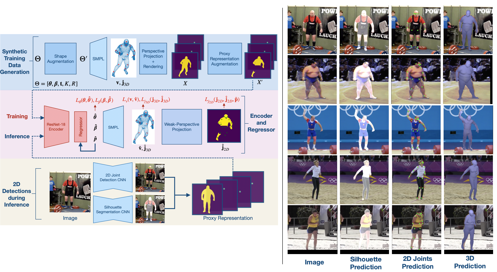

# STRAPS-3DHumanShapePose
Code repository for the paper:  


## Installation

### Requirements
- Linux or macOS
- Python ≥ 3.6

### Instructions
We recommend using a virtual environment to install relevant dependencies. After creating a virtual environment, first install torch and torchvision: `pip install torch==1.4.0 torchvision==0.5.0`

Then install (my fork of) detectron2 and its dependencies (cython and pycocotools):
```
pip install cython
pip install 'git+https://github.com/cocodataset/cocoapi.git#subdirectory=PythonAPI'
pip install 'git+https://github.com/akashsengupta1997/detectron2.git'
```

The remaining dependencies can be installed by simply running: `pip install -r requirements.txt`. This will be sufficient for inference. If you wish run model training, you will require the PyTorch port of Neural Mesh Renderer: `pip install neural_renderer_pytorch==1.1.3`.

### Additional files
You will need to download the SMPL model. The [neutral model](http://smplify.is.tue.mpg.de) is required for training and running the demo code. If you want evaluate the model on datasets with gendered SMPL labels (such as 3DPW and SSP-3D), the male and female models are available [here](http://smpl.is.tue.mpg.de). You will need to convert the SMPL model files to be compatible with python3 by removing any chumpy objects. To do so, please follow the instructions [here](https://github.com/vchoutas/smplx/tree/master/tools).

Download required additional files [here](https://drive.google.com/drive/folders/1phJix1Fp-AbJgoLImb19eXCWEK7ZnAp_?usp=sharing). Place both the SMPL model and the additional files in the `additional` directory such that they have the following structure:

    STRAPS-3DHumanShapePose
    ├── additional                                # Folder with additional files
    │   ├── smpl
    │       ├── SMPL_NEUTRAL.pkl                  # Gender-neutral SMPL model 
    │   ├── cocoplus_regressor.npy                # Cocoplus joints regressor
    │   ├── J_regressor_h36m.npy                  # Human3.6M joints regressor
    │   ├── J_regressor_extra.npy                 # Extra joints regressor
    │   ├── neutral_smpl_mean_params_6dpose.npz   # Mean gender-neutral SMPL parameters
    │   ├── smpl_faces.npy                        # SMPL mesh faces
    │   ├── cube_parts.npy
    │   └── vertex_texture.npy                    # etc.
    └── ...

### Model checkpoints
Download pre-trained model checkpoints for our SMPL regressor, as well as for PointRend and DensePose (via detectron2) from [here](https://drive.google.com/drive/folders/1QX5NBR6GgmfP206bMHN9ZgK8_1QEKSdg?usp=sharing). Place these files in the `checkpoints` directory, like so:

    STRAPS-3DHumanShapePose
        ├── checkpoints                            # Folder with model checkpoints
        │   ├── densepose_rcnn_R_101_fpn_s1x.pkl
        │   ├── pointrend_rcnn_R_50_fpn.pkl
        │   └── straps_model_checkpoint.tar           
        └── ...

### Training data
If you wish to train using the STRAPS framework, we provide pre-processed npz files with training and validation pose parameters [here](https://drive.google.com/drive/folders/1CLOqQBrTos7vhohjFcU2OFkNYmyvQf6t?usp=sharing). Place these files in the `data` directory. Note that the model described in the STRAPS paper was trained on SMPL poses from Human3.6M (obtained using MoSh). We cannot distribute these due to license limitations. However, we have prepared npz files with SMPL poses from the AMASS dataset to replace H3.6M, which should provide similar performance.

## Inference
`run_predict.py` is used to run inference on a given folder of input images. For example, running inference on the demo folder:
```
python run_predict.py --input ./demo --checkpoint checkpoints/straps_model_checkpoint.tar --silh_from pointrend
```
You can choose between using `--silh_from pointrend` and `--silh_from densepose`  to obtain human silhouettes. PointRend provides more accurate silhouettes for easy body poses but DensePose is more robust to challenging body poses.

## Training
The training options within the `run_train.py` file can be edited as desired. Since STRAPS does not require image data, the only training data you are required to download are the pre-processed npz files (above). Then, simply do `python run_train.py`.

## Acknowledgments
Code was adapted from/influenced by the following repos - thanks to the authors!

- [HMR](https://github.com/akanazawa/hmr)

- [SPIN](https://github.com/nkolot/SPIN)

- [VIBE](https://github.com/mkocabas/VIBE)

- [detectron2](https://github.com/facebookresearch/detectron2)

